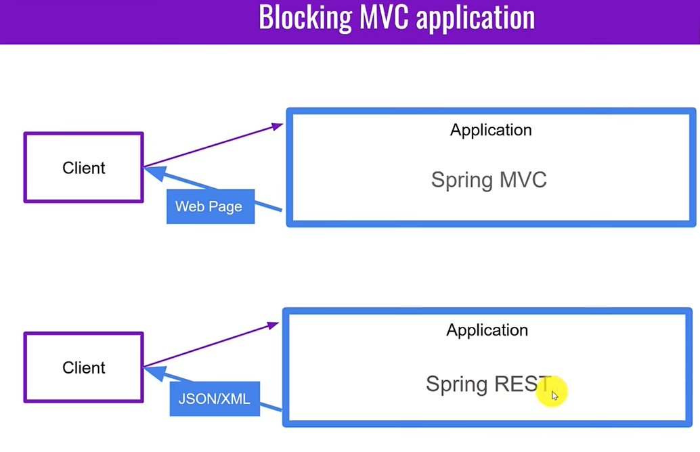
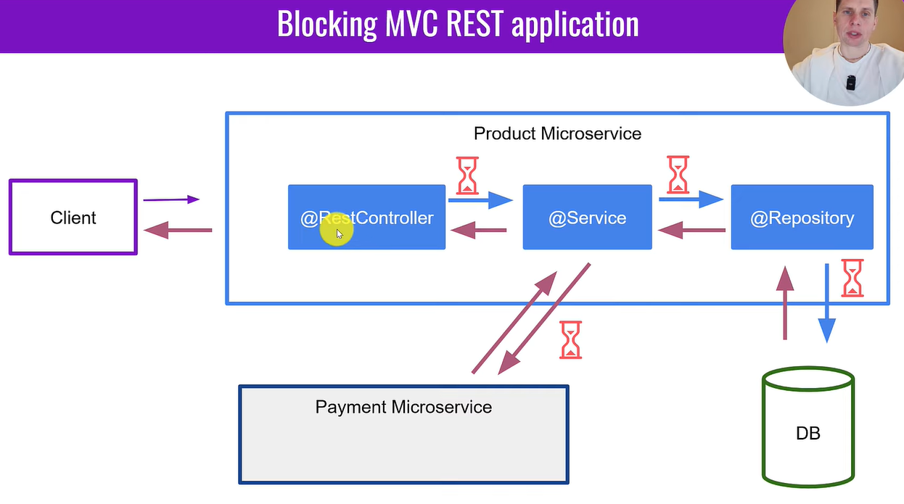
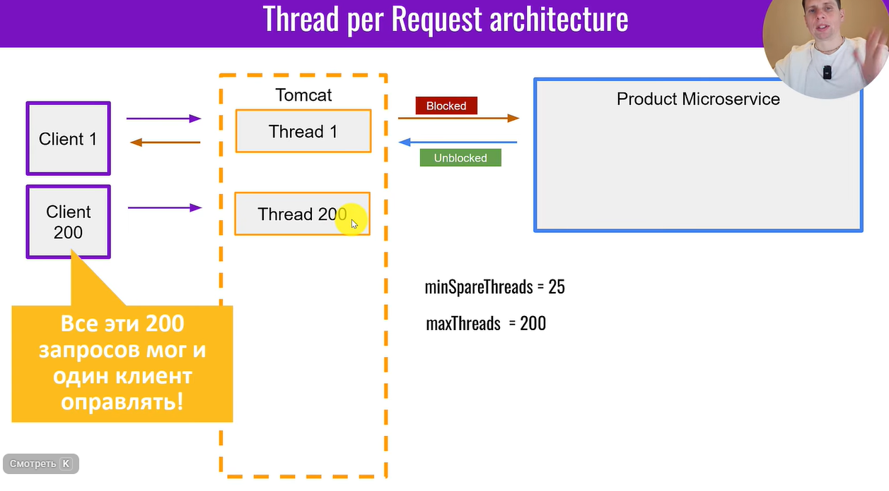
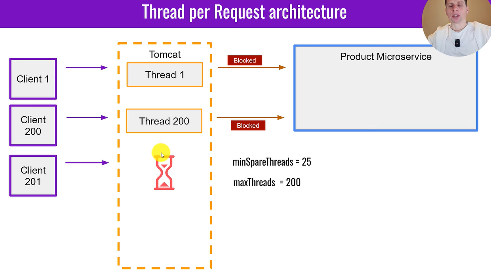
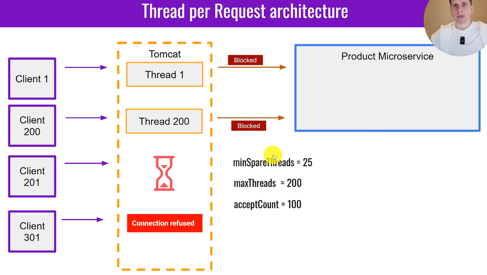
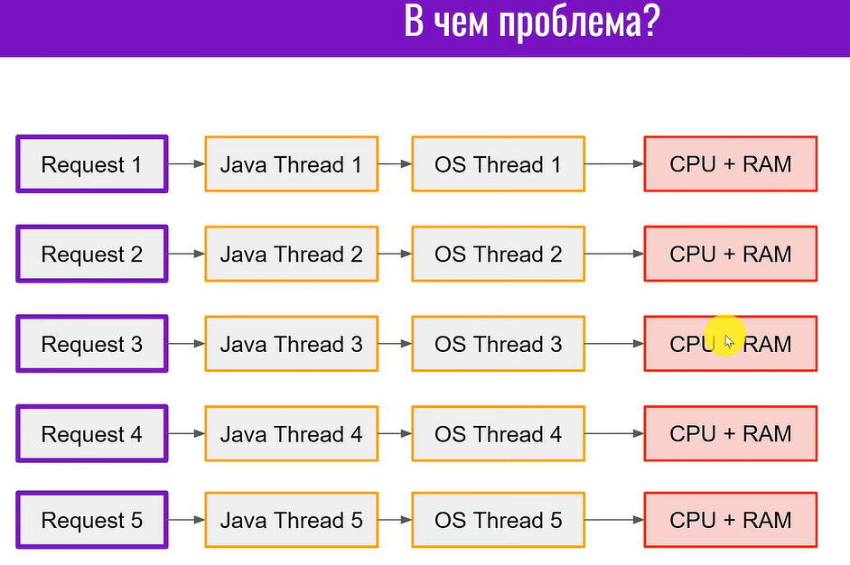
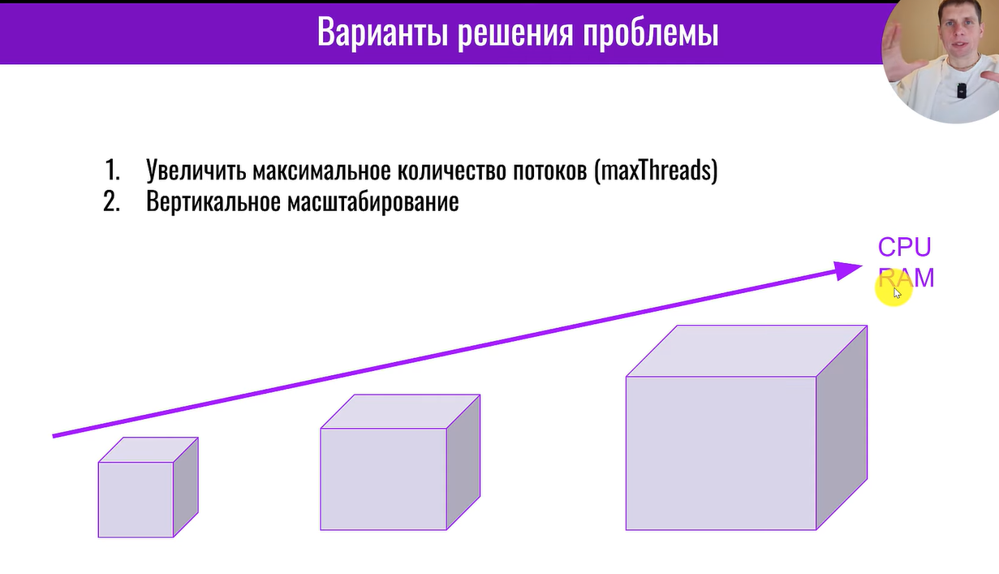
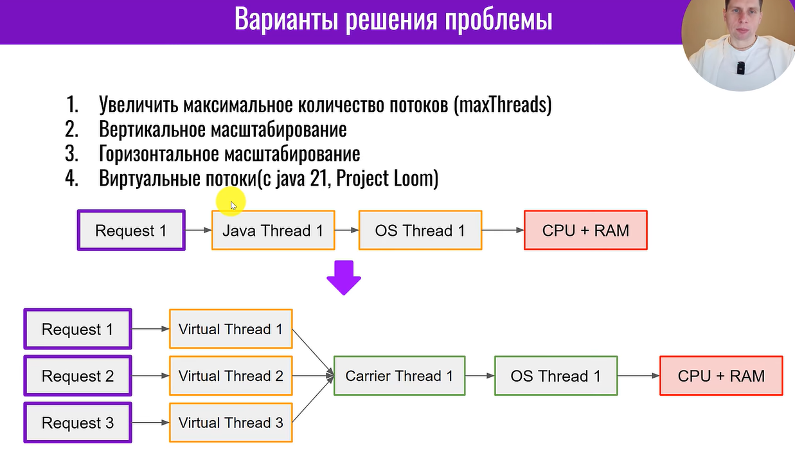

# Getting Started

min запросов 25, max 200 одновременных запросов не обработанных

Когда приходит 301 запрос, то происходит Connection refused [В соединении отказано]

10000 запросов по 1 МБ это уже *10ГБ* оперативки нужно для одного микросервиса.

